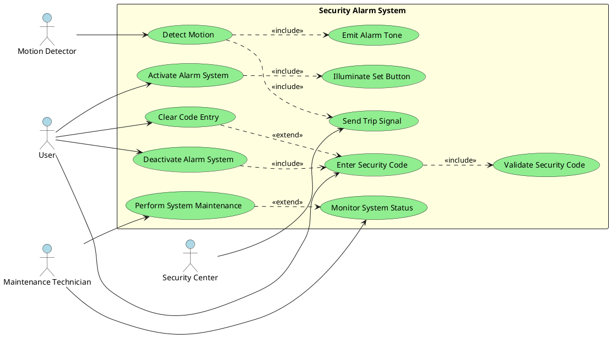

# Exercise 5: Use Case Diagram

## UML Use Case Diagram for Security Alarm System

### Identified Actors

1. **User** - Person who interacts with the alarm system
2. **Security Center** - External monitoring service
3. **Maintenance Technician** - Person who services the system
4. **Motion Detector** - Hardware component (could be considered as actor for external triggers)

### Identified Use Cases

#### Primary Use Cases
1. **Activate Alarm System**
2. **Deactivate Alarm System**
3. **Enter Security Code**
4. **Detect Motion**
5. **Emit Alarm Tone**
6. **Send Trip Signal**
7. **Clear Code Entry**

#### Secondary Use Cases
1. **Illuminate Set Button**
2. **Validate Security Code**
3. **Monitor System Status**
4. **Perform System Maintenance**

### Use Case Relationships

#### Include Relationships (<<include>>)
- **Activate Alarm System** includes **Illuminate Set Button**
- **Deactivate Alarm System** includes **Enter Security Code**
- **Enter Security Code** includes **Validate Security Code**
- **Detect Motion** includes **Send Trip Signal**

#### Extend Relationships (<<extend>>)
- **Clear Code Entry** extends **Enter Security Code** (when error occurs)
- **Perform System Maintenance** extends **Monitor System Status** (when maintenance needed)

### Use Case Descriptions

#### UC1: Activate Alarm System
- **Actor:** User
- **Description:** User presses Set button to activate the security alarm
- **Precondition:** System is deactivated
- **Postcondition:** System is activated and Set button is illuminated
- **Includes:** Illuminate Set Button

#### UC2: Detect Motion
- **Actor:** Motion Detector, User (indirectly)
- **Description:** Motion detector senses movement and triggers alarm
- **Precondition:** System is activated
- **Postcondition:** Trip signal is sent
- **Includes:** Send Trip Signal, Emit Alarm Tone

#### UC3: Deactivate Alarm System  
- **Actor:** User
- **Description:** User enters correct security code to turn off alarm
- **Precondition:** Alarm tone is active
- **Postcondition:** Alarm is deactivated
- **Includes:** Enter Security Code, Validate Security Code

#### UC4: Send Trip Signal
- **Actor:** System
- **Description:** System sends signal to security center when motion detected
- **Precondition:** Motion has been detected
- **Postcondition:** Security center is notified

#### UC5: Enter Security Code
- **Actor:** User
- **Description:** User inputs three-digit code via keypad
- **Precondition:** Alarm is active or system requires authentication
- **Postcondition:** Code is entered and ready for validation
- **Includes:** Validate Security Code
- **Extended by:** Clear Code Entry

### PlantUML Code for Use Case Diagram

### Instructions for Creating the Diagram

#### Using VS Code Extensions:
1. Install **PlantUML** extension in VS Code
2. Copy the PlantUML code above into a `.puml` file
3. Use `Ctrl+Shift+P` → "PlantUML: Preview Current Diagram"

#### Using Online Tools:
1. Visit [PlantUML Online Editor](http://www.plantuml.com/plantuml/uml/)
2. Paste the PlantUML code
3. Generate and export the diagram

#### Alternative Tools:
- **Lucidchart** - Web-based diagramming
- **Draw.io** (now Diagrams.net) - Free online tool
- **Visual Paradigm** - Professional UML tool
- **Creately** - Online collaborative diagramming

### Diagram Validation Checklist

- [ ] All actors are external to the system
- [ ] Use cases represent system functionality
- [ ] Relationships are properly labeled
- [ ] Include relationships show mandatory sub-functionality
- [ ] Extend relationships show optional/conditional functionality
- [ ] All use cases have clear names and descriptions
- [ ] System boundary is clearly defined
